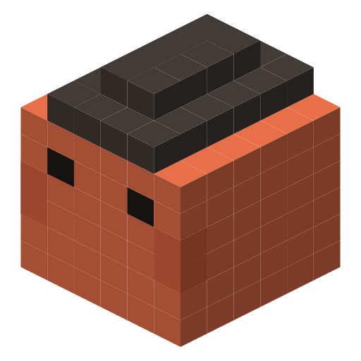

<div align="center">



# Claudme

**Your AI coding agents are a crime family. Now you can see them.**

One pixel crab per running Claude Code session, crawling the edges of your screen.

Native Swift · no Electron · no permissions · ~3 MB · MIT

**An independent community project — not affiliated with Anthropic.**
[Full notice](#not-an-anthropic-product) · [Website](https://marekadvocate.github.io/claudme/)

</div>

---

## Have you lost the dopamine from clauding?

You used to *build* things. Now you type a sentence, watch a spinner, and read a diff.
The work still ships — faster than ever — but the part that felt like something is gone.
Six terminals, six spinners, nothing to look at.

**Here comes the second stage.** Your agents stop being progress bars and become a crew:
named, ranked, wearing colours you recognise, celebrating their own wins along the edge of
your screen. Same output. The feeling comes back.

## Why

If you run one agent, you don't need this. If you run six, you know the problem:

> Which one just finished? Which one is waiting on permission? Which one died on a rate limit?

Claudme moves that question out of your working memory and into your peripheral vision.
Every session becomes a crab on the edge of your screen — never covering your work, but
always telling you who needs you. The crime family part is because it's more fun that way.

## Install

Requires macOS 13+ and Xcode command line tools (`xcode-select --install`).

```bash
git clone https://github.com/marekadvocate/claudme.git
cd claudme
./build.sh
open build/Claudme.app
```

A 🦀 and a count appear in your menubar. Crabs show up along your screen edge within a second.

On first launch Claudme asks once whether to enable **live reactions** — a one-line hook in
`~/.claude/settings.json` that lets crabs react the instant a turn ends instead of up to a
second later. It only ever talks to `127.0.0.1`, always exits 0 so it can never block or slow
Claude Code, and your settings are backed up to `settings.json.bak-claudme` first. Answer once;
it never asks again. Change your mind later with `--install-hooks` / `--remove-hooks`.

**Uninstall:** `build/Claudme.app/Contents/MacOS/Claudme --remove-hooks`, quit, delete the
folder. Nothing else is left behind.

---

## What the crabs tell you

| you see | it means |
|---|---|
| strolling slowly, small | session idle |
| hurrying, full size | session working |
| steam off its head, dilated eyes, jitter | working at `xhigh` or `max` effort |
| stops and hops, `!` bubble | **waiting for you** — permission or input |
| jump, confetti, *"It's done, boss."* | turn just finished |
| curled up on the bottom edge, `z Z` | idle more than 10 minutes |
| wakes up, grumbles, shuffles somewhere else | asleep in the same spot for a minute |
| stretched out in a striped deckchair | it's Friday |
| in the deckchair, but grey and queasy | it's Saturday |
| shaking its head, no chair, no patience | it's Monday |
| ⚠️ bubble | rate limit or API error |
| chewing, 🗜️ bubble, then a burp | compacting its context |
| little crabs bobbing alongside | that session's subagents |
| 🕶️ black shades | running with `--dangerously-skip-permissions` |
| 🤓 round glasses | plan mode |
| 🛰️ orbiting satellite | remote / bridged session |
| bigger, darker crab | bigger model |

**Click a crab** — the terminal running that session comes to the front.
**Right-click** — its working directory, era and status.

**The Dock.** The overlay sits a level above the Dock so the crabs walk in front of it, which
means a crab parked on an icon could swallow the click meant for it. Two things stop that,
and only one of them is a setting.

Always on: a crab loitering in the Dock's band **scurries sideways** as your cursor comes
down, so it is out of the way by the time you arrive.

**Clickable over the Dock** (menubar, on by default): leave it on and the crabs stay
clickable everywhere, relying on them moving aside. Turn it off and Claudme never takes the
mouse inside the Dock's band at all — an icon click can then never be swallowed, at the cost
of not being able to click a crab that is standing there.

## The family

Every session is a made man with a stable name: the same session always produces the same crab.

```
Don Vito Opus IX
 │    │    │   └── numeral, hashed from the session name
 │    │    └────── family: the model it runs on
 │    └─────────── given name, from its era
 └──────────────── rank, earned by staying alive
```

- **Rank** — Picciotto (< 10 min) → Soldato (< 1 h) → Capo (< 4 h) → **Don**
- **Era** — Roman · Medieval · Renaissance · Prohibition · Yakuza · Syndicate
- **Family** — Opus · Fable · Sonnet · Haiku, read from the session transcript
- **Colour** — every live crab wears a different one, matching its dot in the menubar

### Era skins

Each era has its own headwear and markings on the shell, so the era reads even when the hat is
behind a bubble. Colour stays the identity colour, so two crabs of the same era are still
distinguishable.

| era | headwear | shell |
|---|---|---|
| Roman | laurel wreath | toga sash |
| Medieval | spiked crown | chainmail |
| Renaissance | plumed flat cap | ruff collar |
| Prohibition | fedora | pinstripes |
| Yakuza | hachimaki headband | irezumi sleeves |
| Syndicate | cyber visor | circuit trace |

## A life of their own

They greet each other in passing, take a beer break every few minutes and clink glasses if a
neighbour is close, occasionally spin or take a balloon ride when bored, and run a stadium wave
when the last busy session finishes. Crabs that drift too close slide apart.

**Shift change** — a sleeping crab that has lain in the same patch for a minute gets sick of it,
says so, and walks off to a different stretch of the floor, at least a fifth of the edge away.
A session you parked this morning is a crew member with somewhere better to be, not a statue in
one corner.

**The week** — the family knows what day it is. On a **Friday** an idle crab unfolds a striped
deckchair on the edge, leans back and tells you it's Friday. On a **Saturday** it does the same
thing, but the chair is washed out, the crab sways queasily and the line is *"Never again."* On a
**Monday** there is no chair at all — just a slow, unimpressed head shake and *"Monday. Again."*
It picks its moment every 7–15 minutes and only when the session is idle, so it never interrupts
work. Every mood is written in all nineteen languages.

**Traversals** — standing on the ceiling or a side wall *is* the cue: a crab up there rappels
to the floor on a rope 🪢, one on a side wall rockets across to the other 🚀. Both leave the
perimeter for a few seconds, then rejoin it wherever they land. The only pacing is an 18–40 s
settle, which exists purely because a rocket lands on the opposite wall — itself an eligible
spot — and without it the crab would bounce between the two forever.

**Dancing** — whenever anything plays audio on your Mac, the family dances. In 2D the shell
comes apart into its individual pixel cubes and a wave travels diagonally through them; in 3D
the whole body moves. Four moves — bounce, twist, shuffle, headbang — rotating every few bars,
about 30 s of dancing then 30 s off, on each crab's own clock. They keep crawling and working
throughout: the music changes how they move, never what they're doing. Switch it off with
**Party mode**.

## Menubar

| | |
|---|---|
| **The family** | one row per session: rank, colour, status. Click a row to show its terminal |
| **Language** | nineteen of them, plus the Clean / Street talk switch |
| **Speed** | Slow motion · Normal · On something. Normal is the default; the third one is what the app used to do |
| **Crab size** | 50% to 300%, on top of the per-state and per-model scales |
| **Clickable over the Dock** | whether a crab on the Dock takes the click, or the icon does |
| **Playground** | fire any of the fifteen effects on demand instead of waiting out its timer |
| **Party mode** | whether music makes them dance. On by default |
| **3D crabs** | render the family as isometric voxels, like the app icon |
| **Check for updates…** | pull, rebuild and relaunch |
| **Contribute on GitHub** | |

## Languages

Nineteen, picked in the menubar, defaulting to your system language: English, Slovak, Czech,
German, **Greek**, Spanish, French, Hindi, Italian, Japanese, Korean, Dutch, Polish,
Portuguese, Russian, Swedish, Turkish, Ukrainian, Chinese — each in its own script.

None are translations. Each was written in its own crime-fiction register, so the yakuza speak
like yakuza and the Italians like Italians.

### Clean and Street

Every language ships in two registers, switched at the bottom of the **Language** menu:

| | |
|---|---|
| **Street talk** | real underworld argot — Greek *μάγκας*, Polish *grypsera*, Russian *феня*, French *verlan*, Roman *romanesco*, cockney, Bombay *bhai*. It swears. **The default** |
| **Clean** | the crime film you'd watch with your parents in the room |

The strong words ship censored — *"j_bem na to"*, *"k_rwa"*, *"f_ck"* — so a line that lands
on a shared screen reads at a glance without being spelled out in full. Nothing in either
register targets anyone: the crew is crude about the work and the situation, never about
people as a class. Switch to Clean in one click if you'd rather.

## 3D mode

**3D crabs** renders the family as isometric voxels — the same look as the app icon — instead
of flat pixel art. The mark, the app icon, the menubar image and the website logo all come from
one voxel model in [`tools/logo.swift`](tools/logo.swift), so they can never drift apart.

## Updating

**Check for updates…** compares your checkout against the remote and, with your say-so, pulls,
rebuilds and relaunches. It refuses on a dirty tree or a non-git copy rather than touching your
work. By hand: `git pull && ./build.sh`.

---

## How it works

Two independent channels, so it degrades gracefully:

1. **Session registry** — Claude Code maintains `~/.claude/sessions/<pid>.json` for every live
   CLI session, with its name, working directory, start time and status. Polled once a second;
   dead PIDs filtered with `kill(pid, 0)`. This alone gives you crabs and their
   idle/busy/waiting states, with no hooks at all.
2. **Hooks** — for instant reactions, each hook `curl`s its event JSON to a loopback listener on
   `127.0.0.1:48291`. Ten events: SessionStart, UserPromptSubmit, Stop, Notification, SessionEnd,
   SubagentStart, SubagentStop, StopFailure, PreCompact, PostCompact.

The model comes from the tail of the session transcript, cached by file stamp. Audio detection
reads `kAudioDevicePropertyDeviceIsRunningSomewhere` on the default output device — a public
CoreAudio property, so it needs no microphone permission and never touches the audio itself.

Rendering is one borderless, transparent, click-through `NSWindow` per display, sitting one
level above the Dock so crabs walk in front of it. Each crab is a layer-backed `NSView` drawn
entirely in code — **there is not a single image asset in this repo**. Movement is constrained
to the screen perimeter, with the body rotating so the legs always face the edge.

> The session registry is an internal Claude Code detail, not a public API. The parser is
> defensive — if a future version changes the format, the crabs simply don't appear.

### Source map

| file | what it does |
|---|---|
| `SessionRegistry.swift` | polls the session files, reads the model from the transcript |
| `HookServer.swift` | loopback HTTP listener the hooks post to |
| `HooksInstaller.swift` | merges/removes our hooks in `settings.json` |
| `PetManager.swift` | one overlay per display, spawning, ambient behaviour, playground |
| `PetView.swift` | a single crab: geometry, states, dance, traversals, clicks |
| `VoxelSprite.swift` | isometric voxel rendering for 3D mode |
| `Naming.swift` | ranks, eras, made names |
| `Quips.swift` | everything a crab can say, in nineteen languages and two registers |
| `AudioSense.swift` | whether anything is playing on this Mac |
| `TerminalFocus.swift` | walks the process tree to raise a session's terminal |
| `Updater.swift` | self-update via git |
| `tools/logo.swift` | generates the icon, the menubar mark, the SVG and the PNG |

## Known limits

- macOS only. Rendering is AppKit; the process-tree walk is BSD `sysctl`.
- Terminal *tabs* can't be told apart — clicking a crab raises the window, not the tab.
- Sessions started before hooks were installed need a restart to get live reactions.
- In 3D the crabs don't shatter when dancing: isometric depth order is fixed when the sprite is
  composed, so moving the columns independently makes the shape collapse.

## Contributing

MIT, no dependencies, no project file — `./build.sh` is the entire build system.

Good first contributions: **a language** (one entry in `Quips.swift` — write what a mobster
would say in your language, don't translate; a `slangTable` entry is optional), **an idle behaviour** (copy the shape of the beer
break; keep it rare), **an era** (a name pool plus headwear and shell cells).

House rules: no image assets, never block Claude Code, parse the registry defensively.
Details in [CONTRIBUTING.md](CONTRIBUTING.md).

`CLAUDME_DEBUG=1` enables `GET /snapshot` (renders the overlays to a PNG) and
`GET /effect/<name>` (fires a playground effect) — which is how this gets tested without
screen-recording permission.

## Licence

MIT — see [LICENSE](LICENSE).

---

## Not an Anthropic product

Claudme is an independent, unofficial, community-built tool. It is **not made, published,
endorsed, sponsored or supported by Anthropic PBC**, and has no affiliation with them of any
kind.

"Anthropic", "Claude" and "Claude Code" are trademarks of Anthropic PBC. They appear here only
to state truthfully which software Claudme works with. Any resemblance in the name is
unintentional and implies no connection or endorsement.

Claudme reads Claude Code's local session files on your own machine. It sends nothing anywhere,
is not a client for any Anthropic service, and does not use their API. **Please do not contact
Anthropic about this project** — open an issue
[here](https://github.com/marekadvocate/claudme/issues) instead.
